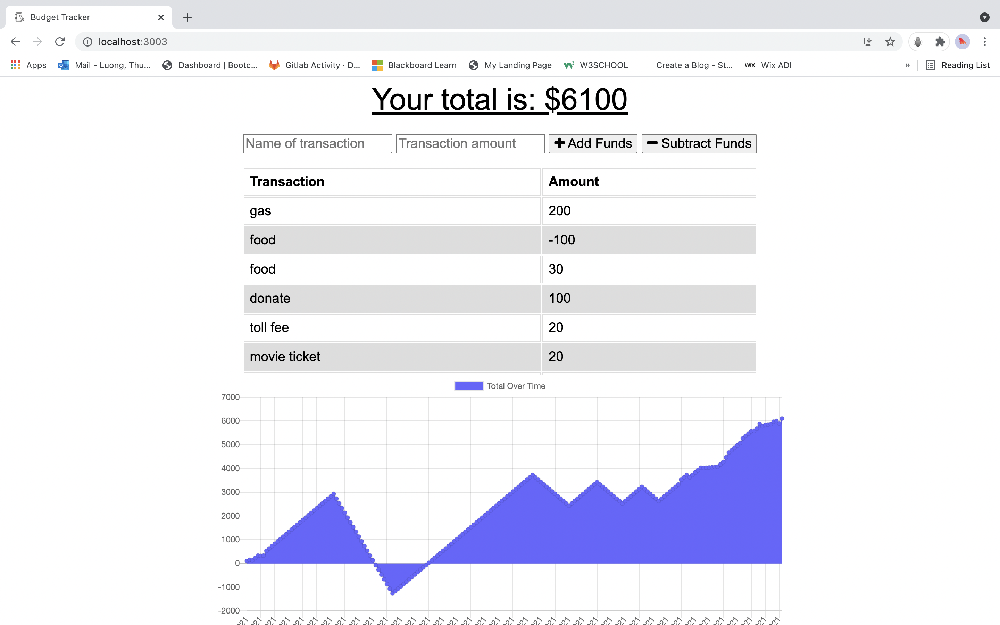
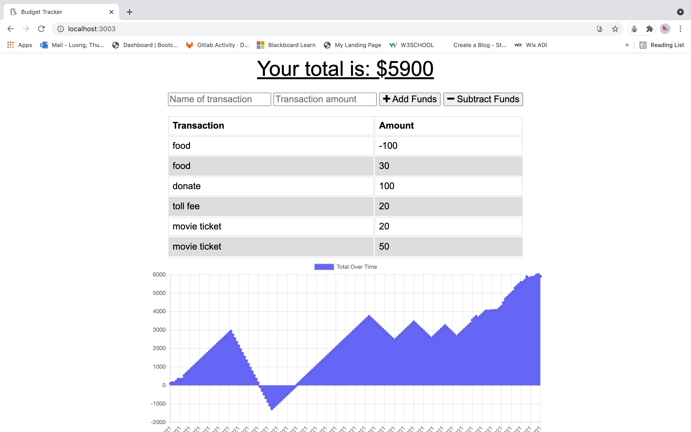

# hw19-online-offline-budgettrackers

[](https://lbesson.mit-license.org/)


# 📋 Description 📋

```
Budget Tracker is an app that helps the user to add expenses and deposits to the users budget with or without a connection. When entering transactions offline, users should populate the total when brought back online.

Offline Functionality:

  * Enter deposits offline

  * Enter expenses offline

When brought back online:

  * Offline entries will be added to tracker.  
```

# 💼 Technologies Used 💼

* `Node.js`
* `npm (Node Package)`
* `Javascript`
* `MongoDb`
* `Mongoose`
* `Express JS`


# 📸 Screenshots 📸






# 🔗 Application Links

* [Github]( https://thuluong249.github.io/hw19-online-offline-budgettrackers/)
* [Heroku Deployment]()

# 📱 Contact 

* [Github](https://github.com/thuluong249)

* <a href="mailto:thujtn2019@gmmail.com">💌 Email</a> 

---